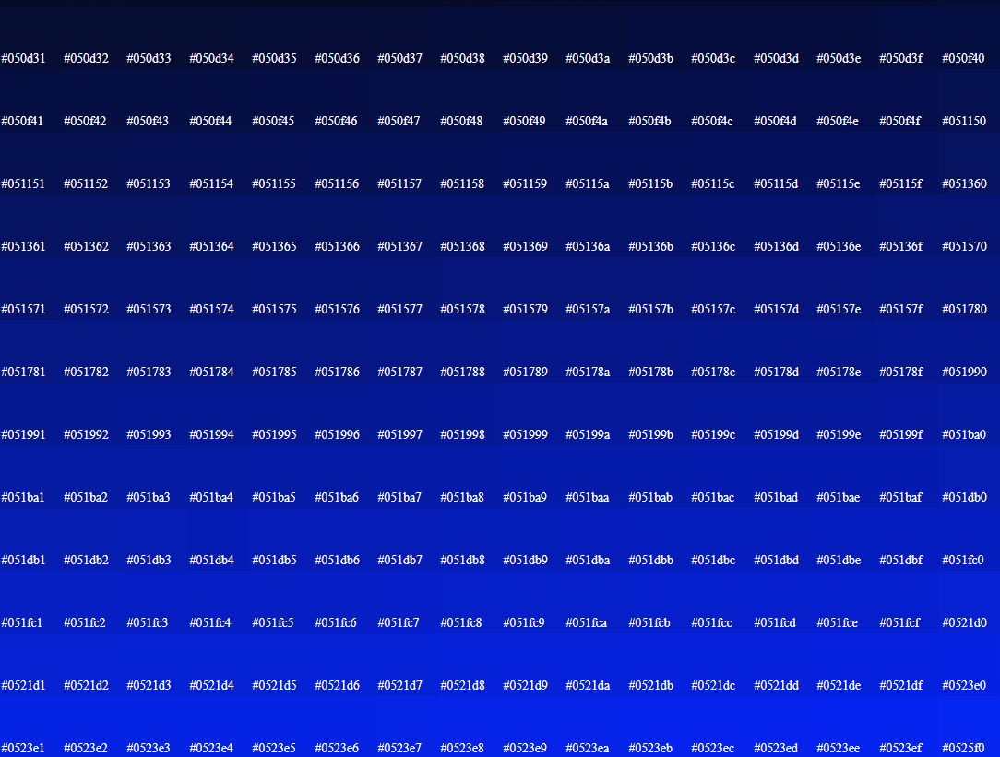
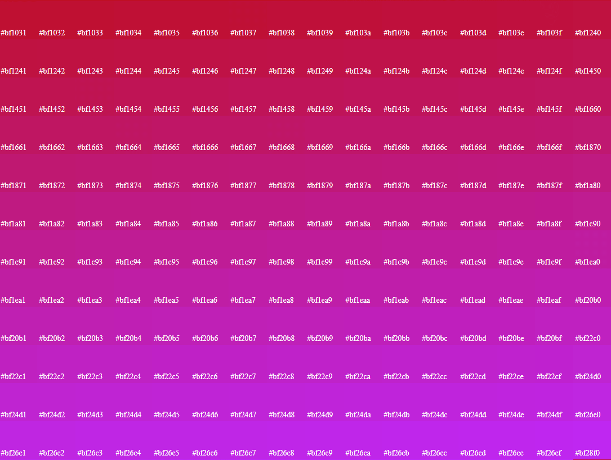

# RGB Colors Visualization

Tiny PHP script for visualizing the Hex RGB color system used in HTML. It may take some minutes to finish (for most PCs). 

To arbitrarily reduce the resource demand, the 'step' for showing colors can be increased (using a power of 2 is encouraged), although it will reduce the effect of the visualization (i.e., it would look less appealing). For example, using a step of 65 536 would make the script end in less than a minute (for most PCs), but the resulting visualization would have a reduced range of colors.

# How do I run it? 
For example, with WAMP (on Windows), LAMP (on Linux) or MAMP (on Mac) and any browser (Chrome, Firefox, Edge, Safari, Opera...). There are a lot of other options.

# Preview

